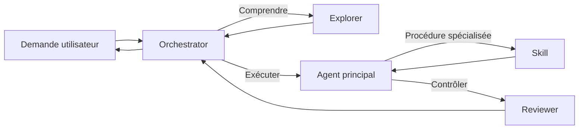

# AI Agents Hub

Template modulaire pour collaborer avec des agents spécialisés et partager des
skills réutilisables dans VS Code avec GitHub Copilot.

## Principes

- **Instructions** : règles permanentes et légères du dépôt.
- **Agents** : rôles spécialisés, contexte isolé et outils minimaux.
- **Skills** : procédures réutilisables chargées à la demande avec leurs
	scripts, références et assets.
- **Prompts** : raccourcis pour une tâche unique et paramétrable.
- **Documentation** : décisions et contrats que les agents doivent pouvoir
	retrouver sans gonfler leurs instructions permanentes.

## Architecture

```text
.
├── .github/
│   ├── copilot-instructions.md       # Règles communes à toutes les tâches
│   ├── agents/
│   │   ├── orchestrator.agent.md     # Décompose et délègue le travail
│   │   ├── explorer.agent.md         # Explore le dépôt en lecture seule
│   │   └── reviewer.agent.md         # Cherche défauts et régressions
│   ├── instructions/                 # Règles ciblées par type de fichier
│   ├── prompts/                      # Commandes simples invoquées avec /
│   └── skills/
│       ├── create-agent/
│       │   └── SKILL.md
│       └── create-skill/
│           └── SKILL.md
├── docs/
│   └── architecture.md               # Contrats et guide d'extension
└── README.md
```

## Flux de travail



L'orchestrateur ne remplace pas les spécialistes. Il choisit le plus petit
agent adapté, transmet un objectif et attend un résultat structuré. Un skill
porte le **comment faire**; un agent porte le **qui décide et avec quels
outils**.

## Démarrage rapide

1. Cloner ce dépôt.
2. Adapter [.github/copilot-instructions.md](.github/copilot-instructions.md)
	 aux commandes et conventions du projet.
3. Garder uniquement les agents utiles et préciser leurs descriptions pour
	 rendre leur déclenchement fiable.
4. Utiliser `/create-agent` ou `/create-skill` dans Copilot Chat pour étendre
	 le catalogue.
5. Versionner les customisations avec le code et les faire relire comme toute
	 autre modification.

## Choisir le bon composant

| Besoin | Composant |
| --- | --- |
| Règle vraie pour presque toutes les tâches | `copilot-instructions.md` |
| Règle liée à un langage ou un dossier | `*.instructions.md` |
| Rôle spécialisé ou restrictions d'outils | `*.agent.md` |
| Workflow multi-étapes avec ressources | `SKILL.md` |
| Action unique réutilisable | `*.prompt.md` |
| Accès à un service externe | Serveur MCP |
| Contrôle déterministe avant/après un outil | Hook |

## Conventions

- Un agent a une seule responsabilité et le minimum d'outils nécessaire.
- Le champ `description` contient les situations concrètes qui déclenchent
	l'agent ou le skill.
- Le dossier d'un skill et son champ `name` portent exactement le même nom.
- Un `SKILL.md` reste court; les détails vont dans `references/` et les
	automatisations dans `scripts/`.
- Les agents de recherche et de revue restent en lecture seule.
- Chaque évolution indique une méthode de validation observable.

Le détail des contrats et la procédure d'ajout se trouvent dans
[docs/architecture.md](docs/architecture.md).